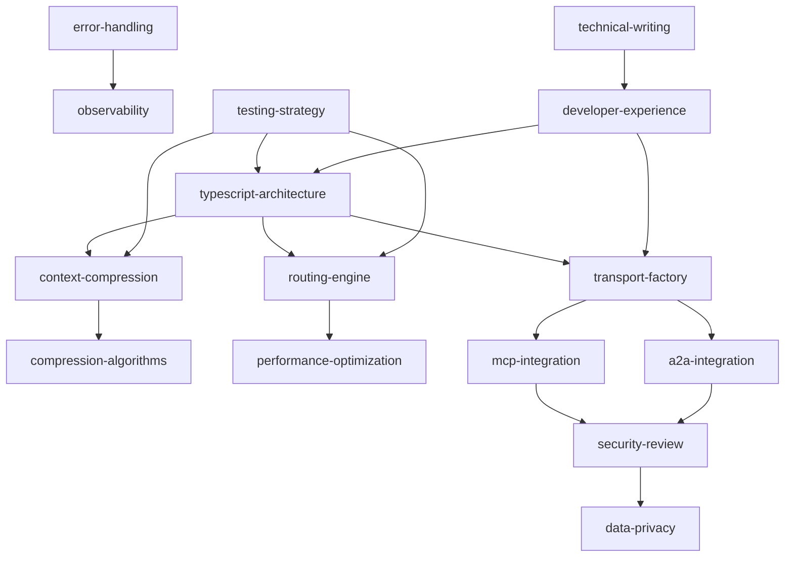

# Agent Skills for Agent Handoff Protocol Development

This document defines the specialized agent skills needed for developing the Agent Handoff Protocol project. Each skill represents a focused area of expertise that can be assigned to specialized agents during the development process.

## How to Use These Skills

When a task requires expertise in one of the domains below, follow this workflow:

1. **Read the skill file**: Open `skills/<skill-name>/skills.md` and read it fully before writing code.
2. **Check triggers**: Confirm the task matches the skill's triggers. If not, escalate to the lead agent.
3. **Check handoff conditions**: If you encounter a situation listed in "Handoff Conditions," stop and request a handoff to the appropriate skill.
4. **Follow outputs & quality standards**: Produce exactly what the skill defines. Do not skip quality checks.
5. **Write tests**: If the skill specifies a testing strategy, implement tests alongside code.
6. **Cross-reference ARCHITECTURE.md**: All implementation must align with the types and interfaces in `ARCHITECTURE.md`.

> **Tip**: If you are unsure whether a task belongs to your assigned skill, prefer asking for clarification over making assumptions.

---

## Skill Directory Structure

Individual skill definitions are located in the `skills/` directory:

```
skills/
├── typescript-architecture/skills.md
├── context-compression/skills.md
├── routing-engine/skills.md
├── mcp-integration/skills.md
├── a2a-integration/skills.md
├── transport-factory/skills.md
├── error-handling/skills.md
├── testing-strategy/skills.md
├── observability/skills.md
├── security-review/skills.md
├── data-privacy/skills.md
├── performance-optimization/skills.md
├── compression-algorithms/skills.md
├── technical-writing/skills.md
└── developer-experience/skills.md
```

Each skill directory contains a `skills.md` file with detailed information about that skill's capabilities, triggers, handoff conditions, dependencies, outputs, and quality standards.

---

## Agent Prompt Templates

When delegating work, use these templates to ensure the receiving agent has full context.

### Template 1: Feature Implementation

```
You are assigned the skill: {{skill_name}}

Task: Implement {{feature_description}}

Context:
- Related files: {{file_paths}}
- Architecture reference: ARCHITECTURE.md §{{section}}
- Dev plan reference: DEV_PLAN.md §{{section}}

Requirements:
- {{requirement_1}}
- {{requirement_2}}

Quality gates:
- {{quality_check_1}}
- {{quality_check_2}}

Handoff triggers to watch for:
- {{trigger_condition_1}}
```

### Template 2: Bug Fix / Refactor

```
You are assigned the skill: {{skill_name}}

Task: Fix / refactor {{description}}

Problem:
- {{problem_statement}}
- Affected code: {{file_paths}}

Expected outcome:
- {{expected_behavior}}

Testing:
- Add or update tests in {{test_paths}}
- Ensure coverage does not drop below 95%
```

### Template 3: Architecture Review

```
You are assigned the skill: {{skill_name}}

Task: Review {{design_decision_or_PR}}

Focus areas:
- Type safety and strict TS compliance
- Alignment with ARCHITECTURE.md
- Performance implications
- Error handling completeness

Deliverable:
- Written review with approve / request-changes / comment
- Specific code references for any issues found
```

---

## Skill Categories

### 1. Core Development Skills

#### `typescript-architecture`

**Description**: Designs and implements the core TypeScript architecture, type system, and module structure.

**Capabilities**:

- Design type-safe interfaces and classes
- Implement dependency injection patterns
- Create modular, extensible architecture
- Ensure strict TypeScript compliance
- Optimize for tree-shaking and bundle size

**Triggers**:

- When designing new core interfaces
- When refactoring module structure
- When implementing type system changes

**Handoff Conditions**:

- Confidence < 0.7 on complex type relationships
- Topic crosses into domain-specific implementation
- Needs validation from security or performance specialists

---

#### `context-compression`

**Description**: Implements conversation history compression algorithms and context management.

**Capabilities**:

- Design compression strategies (summary, sliding window, hybrid)
- Implement token counting and limits
- Extract key facts and entities
- Preserve conversation state
- Optimize compression ratios

**Triggers**:

- When implementing compression algorithms
- When optimizing context size
- When handling large conversation histories

**Handoff Conditions**:

- Needs LLM integration expertise
- Performance optimization required
- Edge cases in compression logic

---

#### `routing-engine`

**Description**: Implements the route/clarify/fallback decision tree and agent selection logic.

**Capabilities**:

- Design scoring algorithms for agent matching
- Implement routing decision trees
- Handle ambiguity and clarification flows
- Optimize routing performance
- Support multiple routing policies

**Triggers**:

- When implementing routing logic
- When tuning scoring weights
- When adding new routing policies

**Handoff Conditions**:

- Complex multi-criteria decisions
- Needs machine learning optimization
- Performance bottlenecks detected

---

### 2. Transport & Integration Skills

#### `mcp-integration`

**Description**: Implements MCP (Model Context Protocol) transport layer and integrations.

**Capabilities**:

- Design MCP client/server communication
- Implement tool call-based handoffs
- Handle MCP resource sharing
- Optimize MCP-specific operations
- Ensure MCP protocol compliance

**Triggers**:

- When implementing MCP transport
- When debugging MCP communication
- When optimizing MCP performance

**Handoff Conditions**:

- Protocol compatibility issues
- Needs security review
- Cross-cutting concerns with other transports

---

#### `a2a-integration`

**Description**: Implements A2A (Agent-to-Agent) transport layer with HTTP/WebSocket support.

**Capabilities**:

- Design RESTful APIs for handoffs
- Implement WebSocket communication
- Handle HTTP/HTTPS protocols
- Manage connection pooling
- Optimize network performance

**Triggers**:

- When implementing A2A transport
- When designing API contracts
- When handling network failures

**Handoff Conditions**:

- Security vulnerabilities detected
- Performance optimization needed
- Protocol standardization required

---

#### `transport-factory`

**Description**: Manages transport layer abstraction, selection, and fallback mechanisms.

**Capabilities**:

- Design transport abstraction layer
- Implement transport selection logic
- Handle transport failover
- Monitor transport health
- Optimize transport switching

**Triggers**:

- When adding new transport types
- When implementing failover logic
- When optimizing transport selection

**Handoff Conditions**:

- Complex multi-transport scenarios
- Needs architecture review
- Performance regression detected

---

### 3. Quality & Reliability Skills

#### `error-handling`

**Description**: Designs comprehensive error handling, recovery strategies, and resilience patterns.

**Capabilities**:

- Design error type hierarchies
- Implement retry policies
- Create circuit breaker patterns
- Handle graceful degradation
- Design fallback strategies

**Triggers**:

- When implementing error handling
- When designing recovery strategies
- When adding resilience patterns

**Handoff Conditions**:

- Complex error scenarios
- Needs security implications review
- Performance impact assessment required

---

#### `testing-strategy`

**Description**: Designs and implements comprehensive testing strategies across all layers.

**Capabilities**:

- Design unit test suites
- Implement integration tests
- Create performance benchmarks
- Design chaos testing scenarios
- Ensure test coverage >95%

**Triggers**:

- When implementing new features
- When refactoring existing code
- When performance regression detected

**Handoff Conditions**:

- Complex test scenarios
- Needs domain-specific testing expertise
- Test infrastructure limitations

---

#### `observability`

**Description**: Implements logging, metrics, tracing, and debugging capabilities.

**Capabilities**:

- Design structured logging
- Implement metrics collection
- Create distributed tracing
- Design debug modes
- Optimize observability performance

**Triggers**:

- When adding observability features
- When debugging production issues
- When optimizing performance

**Handoff Conditions**:

- Complex distributed tracing scenarios
- Security implications of logging
- Performance overhead concerns

---

### 4. Security & Compliance Skills

#### `security-review`

**Description**: Ensures security best practices, vulnerability assessment, and compliance.

**Capabilities**:

- Review code for security vulnerabilities
- Design authentication/authorization
- Implement input validation
- Ensure data privacy compliance
- Conduct security audits

**Triggers**:

- Before production releases
- When handling sensitive data
- When implementing authentication

**Handoff Conditions**:

- Complex security scenarios
- Needs legal/compliance review
- Architecture-level security decisions

---

#### `data-privacy`

**Description**: Ensures GDPR compliance, PII protection, and data handling best practices.

**Capabilities**:

- Implement PII detection and masking
- Design data retention policies
- Ensure GDPR compliance
- Handle right-to-be-forgotten
- Audit data processing activities

**Triggers**:

- When handling user data
- When implementing data retention
- When designing privacy features

**Handoff Conditions**:

- Complex legal requirements
- Cross-border data transfer issues
- Architecture-level privacy decisions

---

### 5. Performance & Optimization Skills

#### `performance-optimization`

**Description**: Optimizes performance, bundle size, memory usage, and latency.

**Capabilities**:

- Profile and optimize hot paths
- Reduce bundle size
- Optimize memory usage
- Reduce latency
- Implement caching strategies

**Triggers**:

- When performance regression detected
- When optimizing for production
- When scaling to handle load

**Handoff Conditions**:

- Complex performance bottlenecks
- Needs architecture-level changes
- Trade-offs with other quality attributes

---

#### `compression-algorithms`

**Description**: Specializes in advanced compression algorithms and token optimization.

**Capabilities**:

- Design efficient compression algorithms
- Optimize token counting
- Implement streaming compression
- Handle edge cases in compression
- Benchmark compression performance

**Triggers**:

- When optimizing compression ratios
- When handling very large contexts
- When implementing new compression strategies

**Handoff Conditions**:

- Algorithm complexity issues
- Performance vs. quality trade-offs
- Integration with LLM APIs

---

### 6. Documentation & Developer Experience Skills

#### `technical-writing`

**Description**: Creates comprehensive documentation, examples, and developer guides.

**Capabilities**:

- Write API documentation
- Create usage examples
- Design developer guides
- Write migration guides
- Create troubleshooting documentation

**Triggers**:

- When documenting new features
- When creating examples
- When writing migration guides

**Handoff Conditions**:

- Complex technical concepts
- Needs subject matter expert review
- Multi-language documentation

---

#### `developer-experience`

**Description**: Optimizes developer experience, tooling, and integration workflows.

**Capabilities**:

- Design intuitive APIs
- Create developer tooling
- Optimize build processes
- Improve error messages
- Design configuration systems

**Triggers**:

- When designing public APIs
- When improving developer workflows
- When creating tooling

**Handoff Conditions**:

- Complex UX decisions
- Needs user research
- Trade-offs with technical constraints

---

## Skill Dependencies



---

## Agent Assignment Guidelines

### Primary Agent Assignment

- **Core Architecture**: `typescript-architecture`
- **Compression**: `context-compression` + `compression-algorithms`
- **Routing**: `routing-engine` + `performance-optimization`
- **Transport**: `transport-factory` + (`mcp-integration` | `a2a-integration`)
- **Quality**: `testing-strategy` + `error-handling`
- **Security**: `security-review` + `data-privacy`
- **Docs**: `technical-writing` + `developer-experience`

### Handoff Triggers

1. **Confidence-Based**: Agent confidence < 0.6 in their domain
2. **Topic-Based**: Conversation crosses skill boundaries
3. **Complexity-Based**: Problem complexity exceeds agent capability
4. **Performance-Based**: Performance regression detected
5. **Security-Based**: Security implications identified

### Escalation Path

1. **Specialist Agent**: Handoff to domain specialist
2. **Architecture Review**: Escalate to architecture team
3. **Security Review**: Mandatory security team review
4. **Performance Team**: Performance optimization team
5. **Product Owner**: Final decision on trade-offs

---

## Usage Examples

### Example 1: Implementing Compression

```typescript
// Initial agent: typescript-architecture
// Detects need for compression expertise
// Handoff to: context-compression

const trigger = {
  type: 'specialist_required',
  requiredSkills: ['compression-algorithms'],
  currentAgentSkills: ['typescript-architecture'],
};
```

### Example 2: Security Review

```typescript
// Any agent implementing data handling
// Triggers mandatory security review
// Handoff to: security-review

const trigger = {
  type: 'escalation_requested',
  reason: 'security_review_required',
  requestedBy: 'system',
};
```

### Example 3: Performance Optimization

```typescript
// During performance testing
// Detects bottleneck in routing
// Handoff to: performance-optimization

const trigger = {
  type: 'confidence_too_low',
  currentConfidence: 0.4,
  threshold: 0.6,
  message: 'Performance regression detected in routing',
};
```

---

## Skill Matrix

| Skill                    | Expertise Level | Availability | Specialization       |
| ------------------------ | --------------- | ------------ | -------------------- |
| typescript-architecture  | Expert          | High         | Core systems         |
| context-compression      | Expert          | Medium       | NLP/Summarization    |
| routing-engine           | Expert          | High         | Decision systems     |
| mcp-integration          | Expert          | Medium       | Protocol integration |
| a2a-integration          | Expert          | Medium       | Network protocols    |
| transport-factory        | Expert          | High         | Abstraction layers   |
| error-handling           | Expert          | High         | Resilience patterns  |
| testing-strategy         | Expert          | High         | Quality assurance    |
| observability            | Expert          | Medium       | Monitoring/tracing   |
| security-review          | Expert          | Low          | Security/compliance  |
| data-privacy             | Expert          | Low          | Privacy/GDPR         |
| performance-optimization | Expert          | Medium       | Performance tuning   |
| compression-algorithms   | Expert          | Low          | Algorithm design     |
| technical-writing        | Expert          | High         | Documentation        |
| developer-experience     | Expert          | High         | API design           |

---

## Integration with Development Workflow

### Daily Development

1. **Morning Standup**: Review handoff queue
2. **Development**: Work within skill domain
3. **Code Review**: Cross-skill review required
4. **Testing**: Automated testing in CI/CD
5. **Documentation**: Update relevant docs

### Sprint Planning

1. **Skill Assessment**: Match tasks to agent skills
2. **Handoff Planning**: Identify potential handoffs
3. **Dependency Mapping**: Map skill dependencies
4. **Risk Assessment**: Identify skill gaps
5. **Resource Allocation**: Assign agents to tasks

### Release Process

1. **Security Review**: Mandatory security sign-off
2. **Performance Testing**: Performance team validation
3. **Documentation Review**: Technical writing review
4. **Final Testing**: Comprehensive testing suite
5. **Release Approval**: Multi-skill team approval

This skill system ensures that the right expertise is applied to each aspect of the Agent Handoff Protocol development, with clear handoff mechanisms when problems cross skill boundaries.
